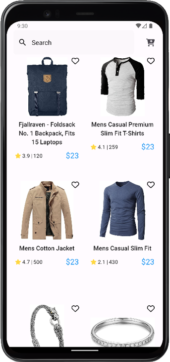
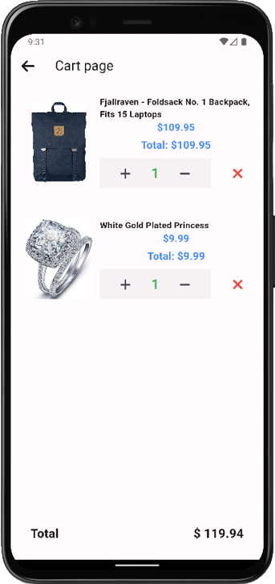

### Download the App

## You can download the latest version of the app for Android by clicking the link below:

- [Download Android APK](https://drive.google.com/file/d/1EliD8IHpH1plbEW3i-YL44eZbQj67cQc/view?usp=sharing)

- [Download for IOS](https://drive.google.com/file/d/1_um-ZvczLemwWaS7UOpO18lqZq2ELbd-/view?usp=sharing)

# The Screenshots of mobile app:-

  

In Home page you can view all the products that are fetched from the server. In addition to it you can serach for the product by title from the search bar and also you can go to your cart section from the cart icon that is presented in  top right corner.

 

  

In Product Detail page you can view more detail about the product and from here you can add the product to your cart. The product that you add will then appears in your cart.

 

  

In Cart page you can view all the products that you have added in your cart. From here you can remove the product from the cart, increase product count, decrease product count. Also you can see your total price updated based on your product price.